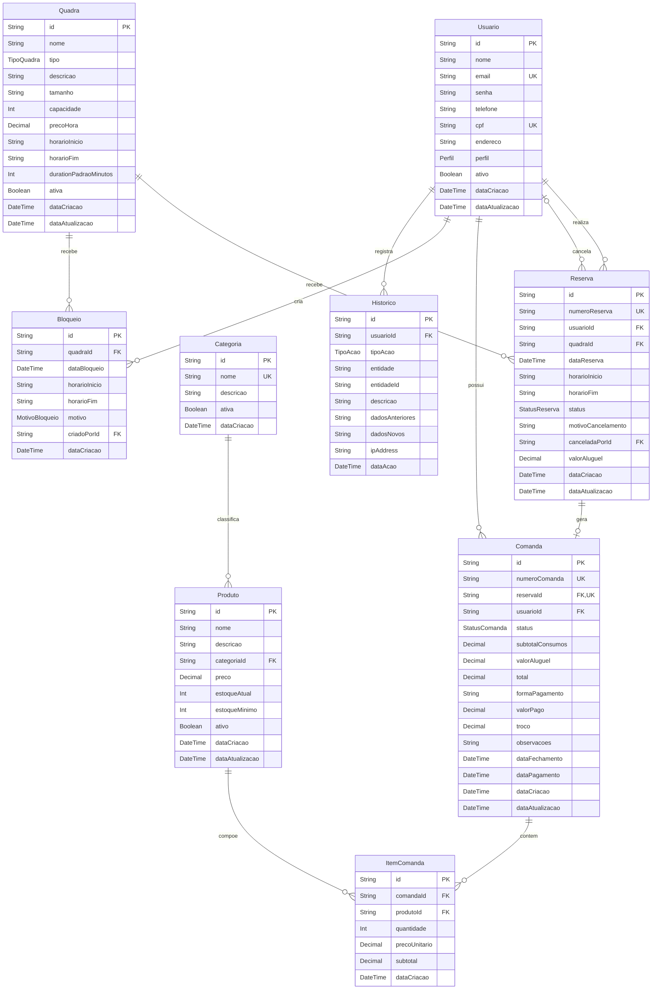

# Esquema relacional — ArenaGo

Este diagrama representa o modelo definido em `schema.prisma`. Os campos marcados
como `FK` são as chaves estrangeiras que mantêm cada relação.

## Cardinalidades principais

- Uma reserva pertence a exatamente um usuário e uma quadra.
- Uma reserva pode ter, no máximo, uma comanda; cada comanda pertence a uma
  única reserva. A chave estrangeira fica somente em `Comanda.reservaId`.
- Uma reserva pode ter sido cancelada por nenhum ou por um usuário. Um usuário
  pode cancelar várias reservas.
- Uma comanda pode possuir vários itens; cada item aponta para um único produto.
- Uma categoria possui vários produtos, e cada produto pertence a uma categoria.
- Usuários podem criar vários bloqueios e registros de histórico.
